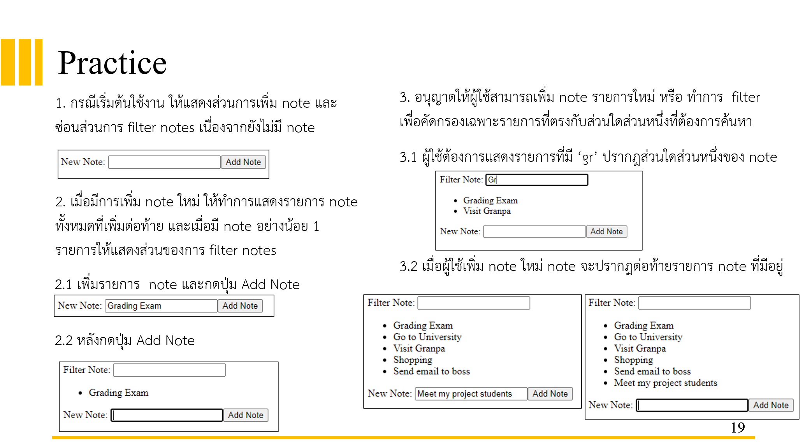

# Requirement

จงเขียนโปรแกรมจาก requirement ดังนี้

## Extra

- เพิ่ม ปุ่มบน filter ให้สามารถเรียงตัวอักษรแบบ A-Z เมื่อกดอีกที่จะเรียงจาก Z-A เมื่อเพิ่ม note เข้าไปจะทำให้ตัวอักษรถูกเรียงกันไปด้วย
- 