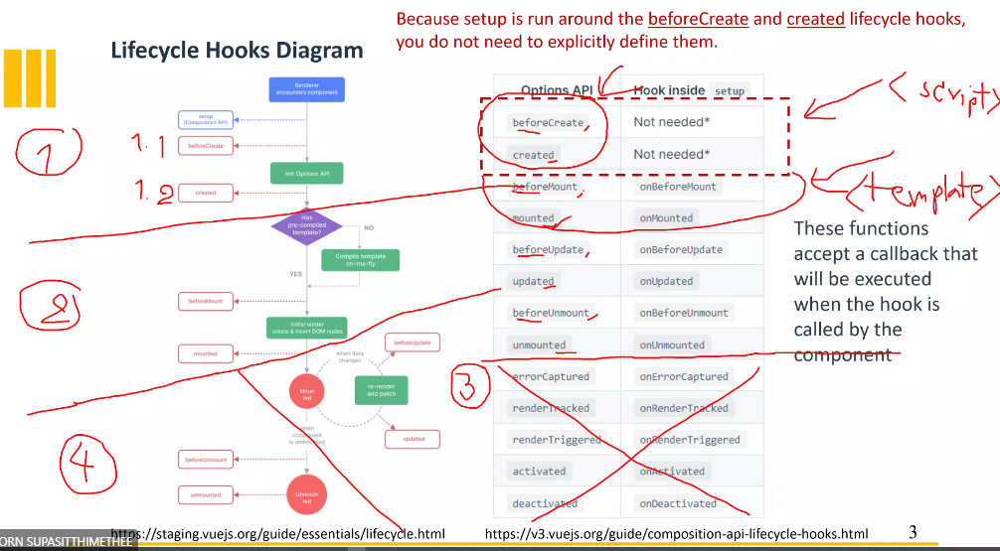

# Vue 3 + Vite

## Life cycle diagram of vue

มี 4 Process

1. Before create and created: ใช้ในการสร้าง composition API
   
2. Before mount and mounted: ใช้ในการสร้าง mount object ที่เป็นลักษณะของ DOM
   
3. Before update and updated: ใช้ในการตรวจสอบค่าที่จะ update โดยการ check ค่าที่เกิด event
   
4. Before unmount and unmounted: ลบ element tag ที่ mount ไว้ 

**Ref:** [Life cycle](https://vuejs.org/guide/essentials/lifecycle.html#lifecycle-diagram)
