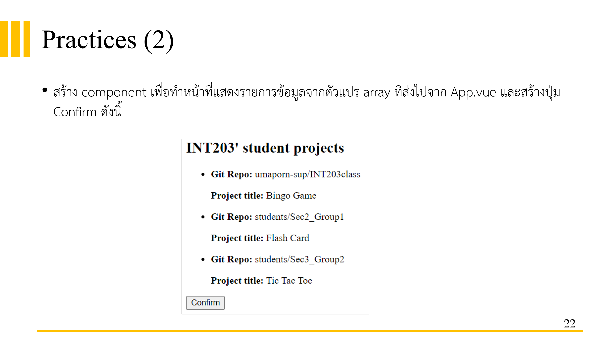

# Vue 3 + Vite

# Requirement

Practice (4) ใน practice (2) ให้ สร้าง component ของปุ่ม + - ให้กับแต่ละ project ใน array ถ้าหากกรณีที่เราชอบ โปรเจคนั้น ให้กดปุ่ม + เพื่อเพิ่มคะแนน 1 คะแนน แล้วถ้าหากเราไม่ชอบ ก็จะกดปุ่มลบ เพื่อลดคะแนนไป 1 คะแนน โดยค่าเริ่มต้นควรจะเป็น 0 และค่าสามารถติดลบได้
